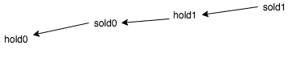
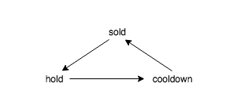

# Stock purchase problem

### 121. Best Time to Buy and Sell Stock

### 122. Best Time to Buy and Sell Stock II \(do as many transaction as you want, once at a time\)

化整为零: make the program more concise: increase with the smallest size when possible, kind of greedy 

followup: what if we are not limited to holding one stock at a time? with initial amount of money  
propose: same idea, buy as many as we can and sell it next day if the price goes up

### 123. **Best Time to Buy and Sell Stock III**

more states to maintain than 121, set up test cases that would be good

```python
def maxProfit(self, prices): 
    """ :type prices: List[int] :rtype: int """
    # [1,0] -> 0 # make sure not transaction happens
    # [1,2,0,0] -> 1, ensure that one-transaction result is considered
    # [1,3,2,5] -> 5
    # [1,2,6,2,3,5] -> 5 + 3, check to make the best trade

    hold0, sell0 = float('-inf'), 0 # setting of initial state is important
    hold1, sell1 = float('-inf'), 0

    for price in prices:
        sell1 = max(sell1, hold1 + price)
        hold1 = max(hold1, sell0 - price)
        sell0 = max(sell0, hold0 + price)
        hold0 = max(hold0, 0 - price)

    return sell1
```



### 309 **Best Time to Buy and Sell Stock with Cooldown**

3 states: sold, cool, hold



```python
class Solution: def maxProfit(self, prices): 
    """ :type prices: List[int] :rtype: int """
    # [1,2] -> 1
    # [1,2,6] -> 5

    sold = 0
    cool = 0
    hold = float('-inf')

    for price in prices:
        prev_cool = cool
        cool = max(cool, sold)
        sold = max(sold, hold + price)
        hold = max(hold, prev_cool - price)
    return sold
```


