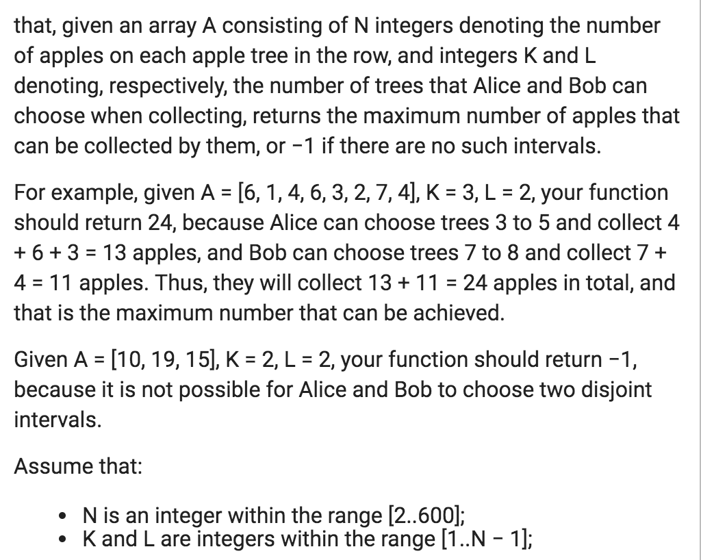

# Two passes

915. Partition Array into Disjoint Intervals \(cache min from one direction and then acc max from the other way around\)  
**One pass solution: eliminate a** 

Contiguous two subarrays

42

84

#### 689. Maximum Sum of 3 Non-Overlapping Subarrays

cache interval sum

