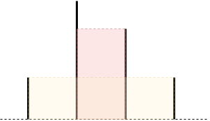

# Greedy prunning

#### 11. Container With Most Water

Brute force takes O\(n^2\), however, we can prune by eliminating non-qualified pairs. 

Formulae: area = \(j - i\) \* min\(heights\[i\], heights\[j\]\)

if we traverse from the largest width to least, we starts from one initial point.

pruning: we keep one side as large as possible; as we move either one side inwards, we can confidently throw that side away because the largest area formed by it is already considered \(look at the formulae, he is the shorter one, then he decides the height, and decreasing the width does no good\)

