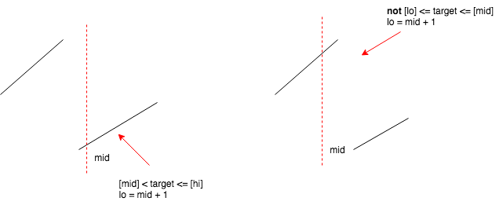

# Rotated array

### 33. Search in Rotated Sorted Array



**Take-away**: make the pointer-advance statements **consistent**: lo = mid + 1

```python
def search(self, nums, target):
    # [], 1 -> 0
    # [1], 1 -> 0
    # [1], 2 -> 1
    # [1,2], 2 -> 1
    # [2,1], 2 -> 1
    # [1,2,3], 2 -> 1
    # [2,3,1], 2 -> 1
    # [3,1,2], 2 -> 2 

    lo, hi = 0, len(nums) - 1
    while lo < hi:
        mid = (lo + hi) // 2

        # check which part mid is on
        if nums[mid] > nums[hi]:
            if not (nums[lo] <= target <= nums[mid]): # the more consitent way to do
                lo = mid + 1
            else:
                hi = mid
        else:
            if nums[mid] < target <= nums[hi]:
                lo = mid + 1
            else:
                hi = mid
    return lo if nums and nums[lo] == target else -1
```

