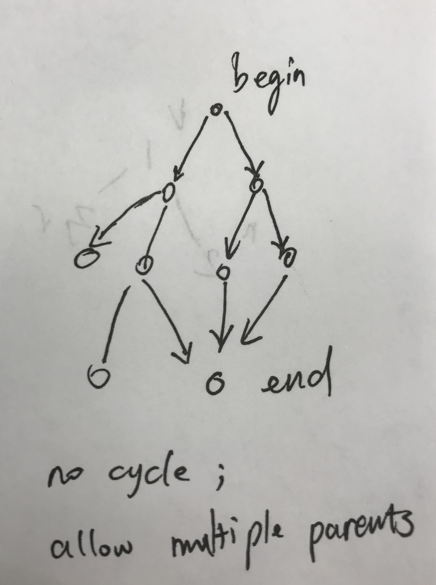

# Word Ladder II

1. BFS to construct graph \(many tricks here\)
2. DFS to find all paths

### the generated graph have the following properties:

* paths from the begin to the end is the shortest
* the end node is the deepest node
* from root to end, not backwards edges
* a node could have multiple parents
* **no edges on the same level of the BFS tree** \(added Sep 3, 2018\)



### The pitfalls

When should set that a node is visited, either when popped and when as a child **no longer** works


working approach: add all edges to the next layer first, then set them all visited


### Optimization

1. map strings to int so that the graph is much concise
2. bidirectional BFS \(we know the begin and goal!!!\)
3. trade-offs of branching factor between dict size and word length

### Code

```python
from collections import deque
import string 
def findLadders(self, beginWord, endWord, wordList):    
    wordList.append(beginWord) 
    wordDict = dict((word, i) for i, word in enumerate(wordList))
    if endWord not in wordDict:
        return []

    def getSuccessors(word):
        for i in range(len(word)):
            for ch in string.ascii_lowercase:
                if ch == word[i]: continue
                yield word[:i] + ch + word[i+1:]

    def constructSubGraph(): # construct a BFS tree-like graph, allowing multiple parents
        graph = {}
        startIndex, endIndex = wordDict[beginWord], wordDict[endWord]
        visited = set([startIndex])
        q = deque([startIndex])
        while q:
            next_level = set() # clitical, cache nodes next layer
            for _ in range(len(q)):
                srcIndex = q.popleft()
                for sucWord in getSuccessors(wordList[srcIndex]):
                    if sucWord not in wordDict:
                        continue
                    destIndex = wordDict[sucWord]
                    if destIndex not in visited:
                        next_level.add(destIndex)
                        graph.setdefault(srcIndex, []).append(destIndex) # add graph suc
            visited.update(next_level)        
            q.extend(next_level)
        return graph

    def searchResults(graph):
        # assume: graph no backwards edges
        results = []
        start, end = wordDict[beginWord], wordDict[endWord]
        work = []
        def search(cur):
            nonlocal end
            if cur == end:
                results.append(work + [end])
                return
            work.append(cur)
            for suc in graph.get(cur, []):
                search(suc)
            work.pop()
        search(start)
        return results

    def convertToWords(indexList):
        return [wordList[index] for index in indexList]

    graph = constructSubGraph()
    results = searchResults(graph)
    return list(map(convertToWords, results))
```

