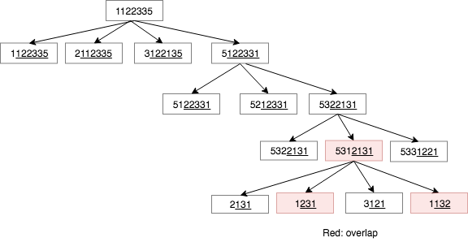

# Counting without repeatedness

### 47. Permutations II

**Essence**: should make sure that each subtree for every node is **unique** \(start with different number\)

At the last level, 1231 and 1132 have shared starting 1, overlapped

### Counting the substrings with at least k consecutive vowels

