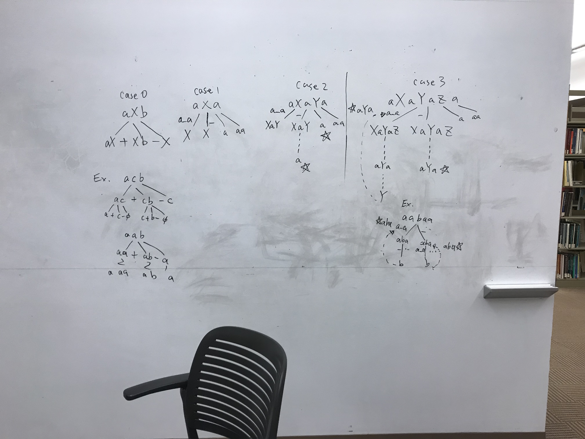

# Counting without repeatedness

### 47. Permutations II

**Essence**: should make sure that each subtree for every node is **unique** \(start with different number\)

At the last level, 1231 and 1132 have shared starting 1, overlapped

### Counting the substrings with at least k consecutive vowels

### 446. Arithmetic Slices II - Subsequence

### 730. Count Different Palindromic Subsequences


difficulties:

1. what to do with pattern like "a\_a", and pattern like "a\_b"
2. how to combine: the count for aXa and X


proposal:

when s\[i\] != s\[j\], count\(i, j\) = count\(i+1, j\) + count\(i, j-1\) + count\(i+1, j-1\)  
otherwise, count\(i, j\) = 2 \* count\(i+1, j-1\)    &lt;=== this is wrong \(single char and empty str\)

thinking process for the top sol in discuss:

cases:

* a\_b
* a\_a
* a\_a\_a
* a\_a\_a\_a

