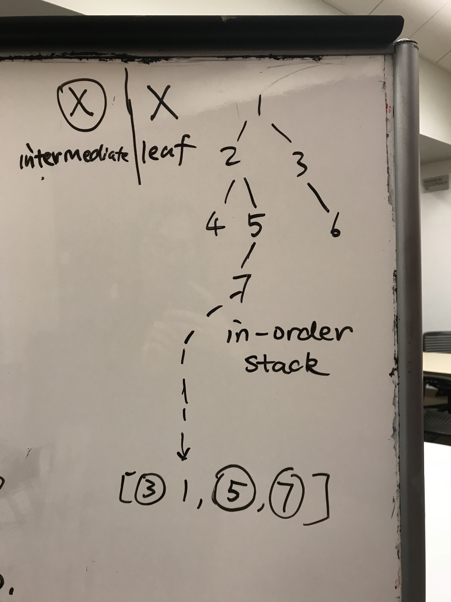
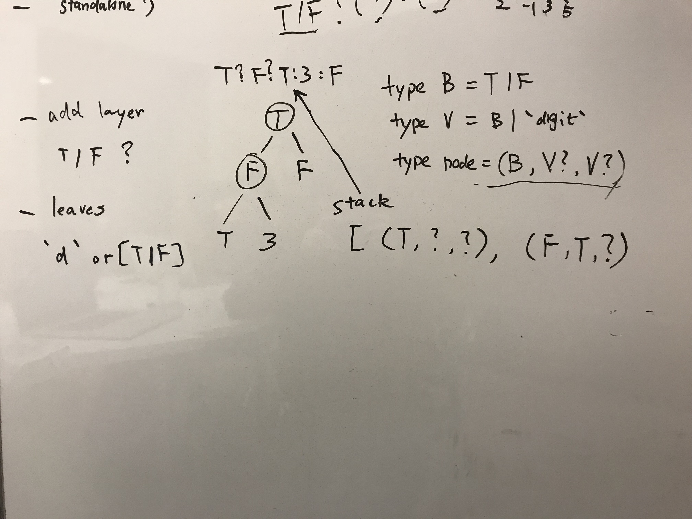

# Stack Problems

stack problems are divided into \(not exhaustively\):

1. implicit tree traversal \(use stack to simulate recursion\)
2. monotonic stack structure to cleverly cache data
3. iterator implementation

For the first type of question. Ask before doing.

**What is type of the elements of stack?**

### Typical problems:

* Tree traversal \(pre-, in-, post-\): **type Elem = TreeNode \|  int** \*\*\*\*
* 439 ternary expression: **type Elem = \(T \| F, \(T \| F \| d\)?, \(T \| F \| d\)\)**  
* 331 verify serialization of binary tree:   $$a = b$$ 

