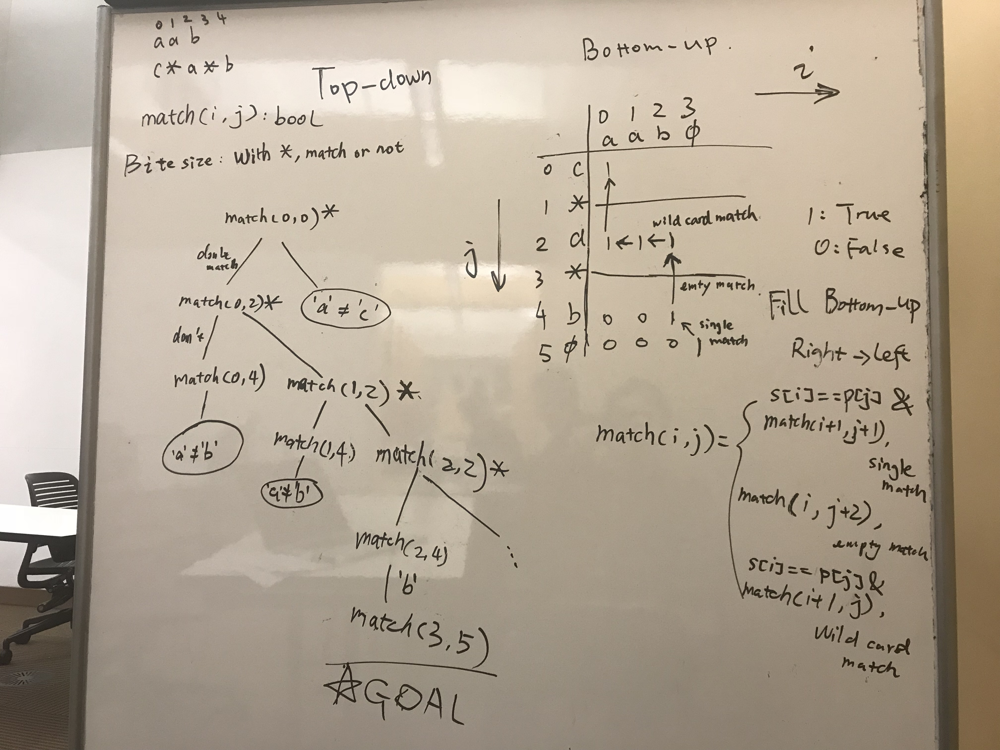
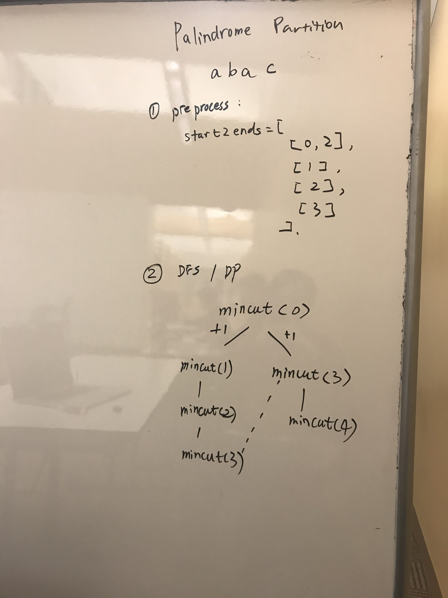

# String matching

### 10. Regular Expression Matching

### 44. Wildcard Matching

### 132. Palindrome Partitioning II

### 115. Distinct Subsequences

a good example of **boundary case** examination

