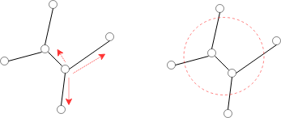
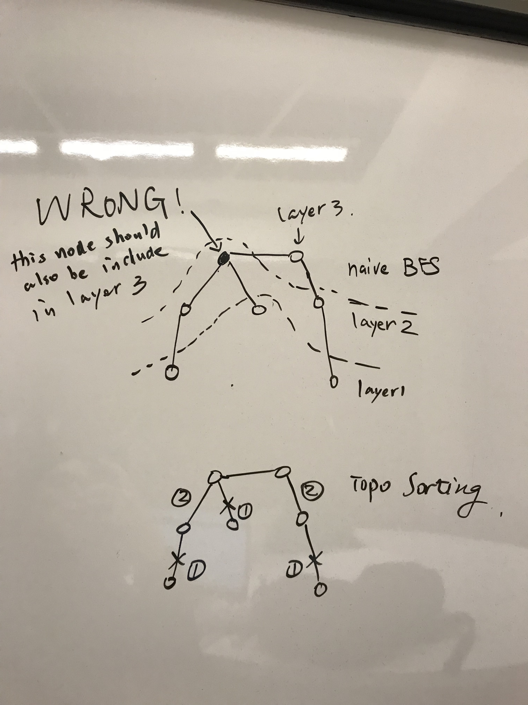

# Toposort

### 310. Minimum Height Trees

two ways to tackle: 1. from every node fanning out 2. from the outmost **contour** shrinking in



two ways to perception: 1. from node, 2. from **edge**: remove edges

Nov: saw solution, new alternatives: find the longest path



### 207. Course Schedule

recipe:  remove **node** in the **current** level

```python
def canFinish(self, numCourses, prerequisites):
    # 1, [] -> True
    # 2, [[0,1]] -> True
    # 2, [[1,0], [0,1]] -> False
    # 3, [[1,0], [2,0]] -> True

    degree = [0] * numCourses
    graph = [[] for _ in range(numCourses)]

    for suc, pre in prerequisites:
        degree[suc] += 1
        graph[pre].append(suc)
    q = deque()
    for i in range(numCourses):
        if degree[i] == 0:
            q.append(i)
    while q:
        node = q.popleft()
        numCourses -= 1
        for suc in graph[node]:
            degree[suc] -= 1
            if degree[suc] == 0:
                q.append(suc)
    return numCourses == 0
```


DFS + memo approach:

take away: clever use of **all** and **any**  
any: for early quit if find one unsatisfied  
all: for early quit if find one satisfied

```python
def canFinish(self, numCourses, prerequisites):
    ''' DFS + memo '''
    n = numCourses
    graph = [[] for _ in range(n)]
    canSolve = [None] * n
    
    def constructGraph():
        for suc, pred in prerequisites:
            graph[suc].append(pred)
            
    def solve(course):
        if canSolve[course] is not None:
            return canSolve[course]
        canSolve[course] = False
        # as soon as we meet a predesuccesor we cannot 
        if any(solve(pred) == False for pred in graph[course]):
            return False
        canSolve[course] = True
        return True
        
    constructGraph()
    return all(solve(i) for i in range(n)) # should 

# tests
# 2, [[1,0]] -> True
# 2, [[1,0],[0,1]] -> False
# 3, [[1,0],[1,2]] -> True
# 3, [[1,0],[0,2], [2,1]] -> False
```

