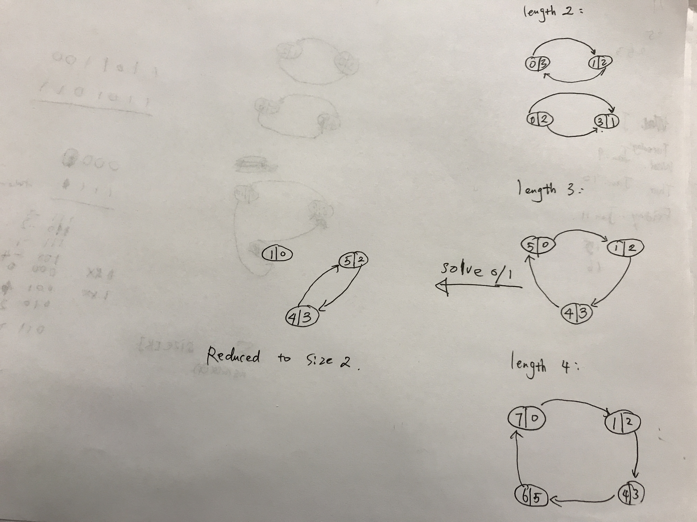

# 765. Couples Holding Hands


1. view \[2x, 2x+1\] as a slot, a node in the graph
2. connect slots using \(2y, 2y+1\) as edges, \(2y, 2y+1\) is a pair of arbitrary couple
3. edges are undirected





$$
\#fixes ‎=‎ {‎‎\sum}_{k=roots(G)} max(size[k]-1, 0)
$$

alternative impl: can use DFS to flood fill, O\(n\) time guaranteed

```python
def minSwapsCouples(self, row):    
    # start from n=2, in which two cases (0 - 1), (0 1) - connected or not
    
    # nodes: index (0,1), (2,3) ...
    # impl: draw edges from nodes 2*x -> 2*x+1
    # count number of edges: |E|, return |E| - 1
    # wrong! count connected component instead
    
    n = len(row) // 2
    
    id_ = list(range(n))  # nodes are two-seat couches
    sz = [1] * n
    
    def find(p):
        while p != id_[p]:
            id_[p] = id_[id_[p]]
            p = id_[p]
        return p
    
    def union(p, q):
        proot, qroot = find(p), find(q)
        if proot == qroot:
            return
        mergingRoot, mergedRoot = (proot, qroot) if sz[proot] >= sz[qroot] else (qroot, proot)
        id_[mergedRoot] = mergingRoot
        sz[mergingRoot] += sz[mergedRoot]
    
    # draw edges from nodes containing 2*x to nodes containing 2*x + 1
    person2slot = [-1] * (2 * n)
    for i, person in enumerate(row):
        person2slot[person] = i // 2
    
    # union slots by edges
    for x in range(n):
        union(person2slot[2*x], person2slot[2*x+1])
        
    # for each component, # steps to take are max(0, #nodes - 1)
    return sum(max(0, sz[slot] - 1) for slot in range(n) if find(slot) == slot)

# tests
# [0,1]
# [0,1,2,3] - in place
# [0,2,1,3]
# [3,1,2,0]
# [0,5,1,2,3,4] -- cycle length 3
# [0,2,3,4,5,6,1,7] -- cycle length 4
# -- multiple components -- bug
# [1,4,0,5,8,7,6,3,2,9]
# [0,3,1,2,4,7,5,6,8,13,9,10,11,12] - sizes [2,2,3]
```

