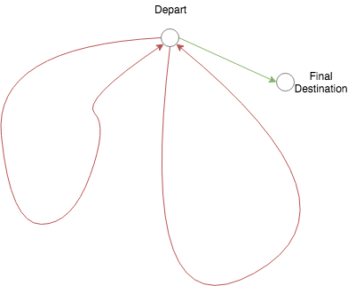
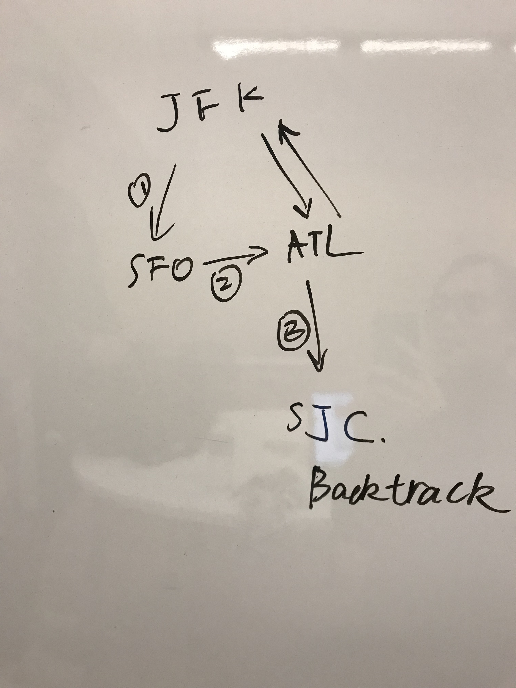

# DFS

## Todo List

### 785. Is Graph Bipartite?


## Problems

### 332. Reconstruction Itinerary

much complicated than 207/210: allow cycle the in path  
saw Stefan's solution



Nov: a new method to tackle it with **queue, prove** that the path order remain unchanged after a layer \(including recursive call\) of execution



The **beauty** of back tracking !!!

```python
def findItinerary(self, tickets):
    # a easy way to do back track: not the optimal, actually with queue -> optimal
    # avoid using 2-d map
    
    # construct graph
    graph = {} # {str: str[]}
    for src, dest in tickets:
        graph.setdefault(src, []).append(dest)
    # fix for picking order of destination
    for src in graph:
        graph[src] = deque(sorted(graph[src]))
        
    hops = len(tickets)
    
    work = ['JFK']
    def constructPath(): # return if the with the current work list, is it able to construct the path correctly
        nonlocal hops
        
        if len(work) == hops + 1:
            return True
        start = work[-1]
        q = graph.get(start, []) # nothing
        # try all the successor without duplicate
        # not sure the order would remain?
        for _ in range(len(q)):
            dest = q.popleft()
            work.append(dest)
            if constructPath():
                return True
            work.pop()
            q.append(dest)
        return False
    
    constructPath()
    return work
```


