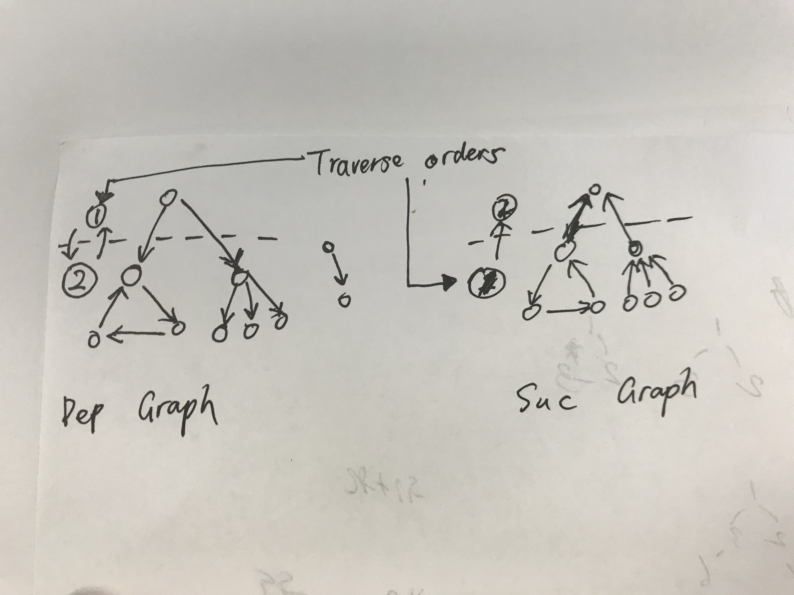

# Tree Related


### 133. Clone Graph

Input is given by a **node**, implying that we deal with a connected component, a **tree-like structure with backward edges;** On the other hand, if the input is given by adjacent matrix, no need to copy

* DFS, most straight-forward, post-order, first solve dependencies and then the current node
* BFS, have to create a node first and fill its neighbors at deeper levels, one less buggy solution: do two passes, first create node, second filling

### 207. Course Schedule \(**210 Course Schedule II**\)

Initially convert the edge collection into adjacent lists, 

* DFS: construct dependencies graph: dependant -&gt; dependency \(same direction of the definition, top-down\)
* BFS: construct successor graph: prerequisite -&gt; children \(the other way around\)
* 


```python
def canFinish(numCourses, prerequisites):
    """
    :type numCourses: int
    :type prerequisites: List[List[int]]
    :rtype: bool
    """
    # time/space: O(n)
    
    # 2, [[0,1]] -> True
    # 2, [[0,1], [1,0]] -> False
    
    # assumption: no duplicate edges -> simple graph
    # DFS
    dependencies = [[] for _ in range(numCourses)]
    
    for clss, dep in prerequisites:
        dependencies[clss].append(dep)
    
    # memoization
    solved = {}
    # path = []
    def solve_dep(clss):
        if clss in solved:
            return solved[clss]
        solved[clss] = False # clitical, prevent loop; assumption is correct
        for dep in dependencies[clss]:
            if not solve_dep(dep):
                break
        else:
            solved[clss] = True
            # TODO: for result requiring the topological sorting path
            # path.append(clss) all dependencies solved, add to the list safely
        return solved[clss]
    
    return all(solve_dep(clss) for clss in range(numCourses))
```


### 261. Graph Valid Tree

tricky to use: without using set to maintain met nodes, set children to None \(making use of the constructed data structure\)

```python
def validTree(self, n, edges):
    # properties of tree: 
    # 1. connected (one connected component), 2. no cycle

    if n - 1 != len(edges):
        return False

    def constructGraph(): # easy to construct given nodes as consecutive numbers
        graph = [[] for _ in range(n)]
        for a, b in edges:
            graph[a].append(b)
            graph[b].append(a)
        return graph

    graph = constructGraph()

    # test
    # 1, [] -> True
    # 2, [] -> False
    # 2, [[0,1]] -> True
    # 3, [[0,1],[2,1]] -> True
    # 4, [[0,1], [0,2], [1,2]] -> False

    # DFS
    stack = [0]
    while stack:
        node = stack.pop()
        if graph[node] is not None: # the value for a node is ever once non-None
            stack.extend(graph[node])
            graph[node] = None
            n -= 1
    return n == 0
```

