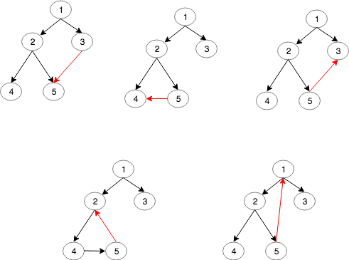

# Redundant Connection II

Union-find used here, but usually UF is suspectible for **directed** graph since the connected components might be **weakly** **connected** \(as we take the directed edge as undirected ones\)

Construction of input:



a, b, c: don't form cycles; d, e form cycles

Two Branches: \(because it is hard to detect cycle in directed graph, we divide cases according to other criterion\)

1. all nodes have parent \(if so, exactly one for each, think about why, hint: the root\): in this case, we know there must be a **cycle**
2. exactly one node has two parents i. if there is no **cycle**, simply return the later edge ii. if cycle: only **one** edge in the cycle, return that edge

bug1: we need to reversely construct the whole graph \(including the every edge\), otherwise bug

```python
class Solution:
    def findRedundantDirectedConnection(self, edges):
        """
        :type edges: List[List[int]]
        :rtype: List[int]
        """
        # two cases (wrong at first):
        # 1. no cycle: there must be a node that has two parents, remove the edge from the later parent
        # 2. a cycle: dynamically detect cycle using union find
        # correction 
        
        # when a cycle exists, it is possible that a node has two parents (backwards node)
        # originally a tree with directed edges, add the addtional edge to the tree either
        # 1. forward edge or (from high or equal level) 2. backward edge (from lower level)
        
        n = len(edges)
        
        ids = [i for i in range(n + 1)]
        sz = [1] * (n + 1)
        def root(p):
            while ids[p] != p:
                ids[p] = ids[ids[p]]
                p = ids[p]
            return p
        
        def union(p, q):
            proot, qroot = root(p), root(q)
            if proot == qroot:
                return False
            if sz[proot] >= sz[qroot]:
                ids[qroot] = proot
                sz[proot] += sz[qroot]
            else:
                ids[proot] = qroot
                sz[qroot] += sz[proot]
            return True
        
        child2parent = {}
        def in_cycle(node):
            if node not in child2parent:
                return False
            cur = child2parent[node]
            while cur in child2parent:
                if cur == node:
                    return True
                cur = child2parent[cur]
            return False
        
        # tests 1 ~ 4
        # [[1,2], [1,3], [2,3]] -> [2,3] # no cycles, should return the second parent
        # [[1,2], [2,3], [3,1]] -> [3,1] # all nodes in cycle (every node has a parent)
        # [[1,2], [2,3], [3,4], [4,1], [1,5]] -> [4,1] # partial nodes in cycle and every node has a parent
        # [[2,1],[3,1],[4,2],[1,4]] -> [2, 1] # partial nodes in cycle (there is a node that doesn't have parent, the root)
        first_parent, second_parent, child = None, None, None
        last_edge_in_cycle = None # actually a weakly connected cycle
        for src, dst in edges:
            if dst in child2parent: # case 1, 4
                # bug: originally return the edge directly
                # important: shouldn't remove an edge that is connected backwards to the root
                # namely, shouldn't disconnect the graph
                first_parent, second_parent, child = child2parent[dst], src, dst
                continue # should construct the whole graph until decision is made
            child2parent[dst] = src
            
            if not union(src, dst): # detect cycle: case 2, 3
                last_edge_in_cycle = [src, dst]
            
        if len(child2parent) == n: # handle the case that every node has a parent
            return last_edge_in_cycle
        if in_cycle(first_parent):
            second_parent = first_parent # trick to reduce amount of code
        return [second_parent, child] 
```

