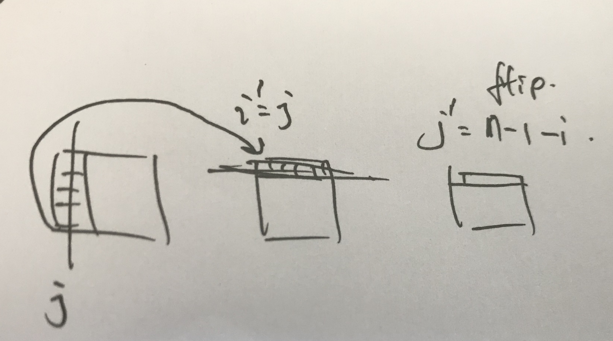

# Rotation

### 48. Rotate Image

Solve the problem **mathematically**

```java
// relationship between the original position of a pixel and the after 
// M[i][j] -> M[j][n-1-i]
```



```java
class Solution { 
    // [[1]] -> [[1]] 
    // [[1,2], [3,4]] -> [[3,1],[4,2]] 
    // 3 by 3 public 
    void rotate(int[][] matrix) { 
        // two phases based on swap: 1. M[i][j] -> M[j][i];  2. M[i][j] -> M[i][n-1-j]
        flipDiagnal(matrix);
        flipHorizontal(matrix);
    }

    // flip according to the diagnal line from (0, 0) to (n-1, n-1)
    // 1 2          1 3
    // 3 4    ->    2 4
    private void flipDiagnal(int[][] matrix) {
        int n = matrix.length;
    
        // flip the bottom left triangle to top right
        for (int i = 1; i < n; i++) { // bug: originall i < n - 1
            for (int j = 0; j < i; j++) {
                swap(matrix, i, j, j, i);
            }
        }
    }
    
    // flip according to the central line from (0, n/2 - 1) to (n-1, n/2 - 1)
    // 1 2      2 1
    // 3 4  ->  4 3
    private void flipHorizontal(int[][] matrix) {
        int n = matrix.length;
    
        for (int i = 0; i < n; i++) {
            for (int j = 0; j < n / 2; j++) { // j < n / 2, without equal sign
                swap(matrix, i, j, i, n - 1 - j);
            }
        }
    }
    
    private void swap(int[][] matrix, int i1, int j1, int i2, int j2) {
        int temp = matrix[i1][j1];
        matrix[i1][j1] = matrix[i2][j2];
        matrix[i2][j2] = temp;
    }
}
```


