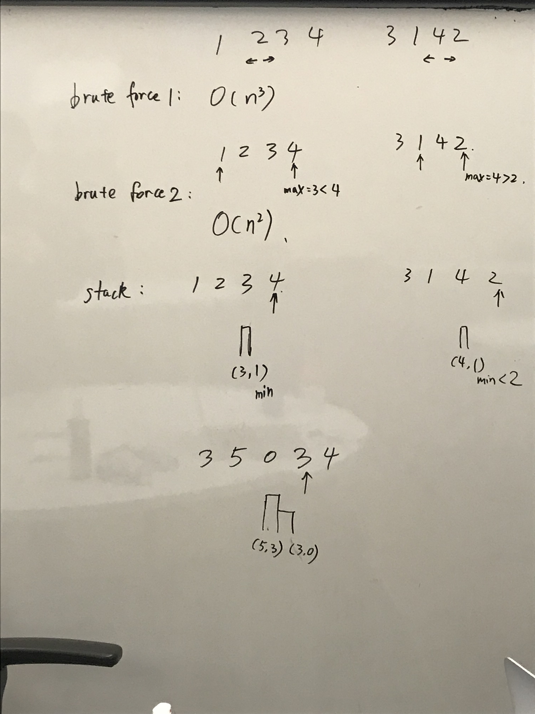

# Monotonic stack

### 42. Trapping Rain Water

```python
def trap(self, height):
    # tag: stack, maintain a decreasing stack
    stack = [] # store the indexes of the left end
    
    result = 0
    for rightIndex, rightHeight in enumerate(height):
        while stack and rightHeight >= height[stack[-1]]:
            base = height[stack.pop()]
            if stack:
                leftIndex = stack[-1]
                leftHeight = height[leftIndex]
                result += (min(leftHeight, height[rightIndex]) - base) * (rightIndex - leftIndex - 1)
        # bug: [4,2,3]
        stack.append(rightIndex)
    return result
```

buggy code, order of doing things

4 different approaches to tackle this problem

### 84. histogram

### 503. Next Greater Element II

associate the right values to left

solution: clever to deal with circular structure instead of copying -&gt; modulo

### 402. Remove K Digits

greedy: increasing stack

### 456. 132 Pattern



```python
def find132pattern(self, nums):
    # idea: decreasing stack + min cache, increasing stack doesn't seem to work
    mn = float('inf')
    stack = [] # (int, int)[], element and the min val before it
    
    for i, num in enumerate(nums):
        if mn < num:   
            while stack and num >= stack[-1][0]: # maintain decreasing 
                stack.pop()
            # possibly 32 pattern
            if stack and num > stack[-1][1]: # 132 pattern
                return True
            stack.append((num, mn)) # store 13 pattern
        mn = min(mn, num)
    return False

# tests
# [1,2,3]
# [1,3,2]
# [2,3,1] -> F
# [3,5,0,3,4], didn't cover
```

maintaining a decreasing stack eliminates unnecessary compares:

* 13 patterns are naturally stored \(with caching min value\)
* 32 pattern can be found by popping from the stack

bonus: approach \#3 in official solution


### 484. Find Permutation

also greedy


