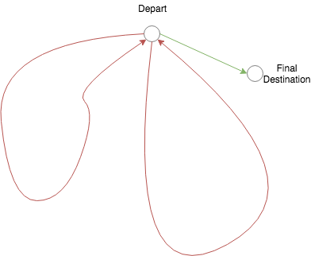
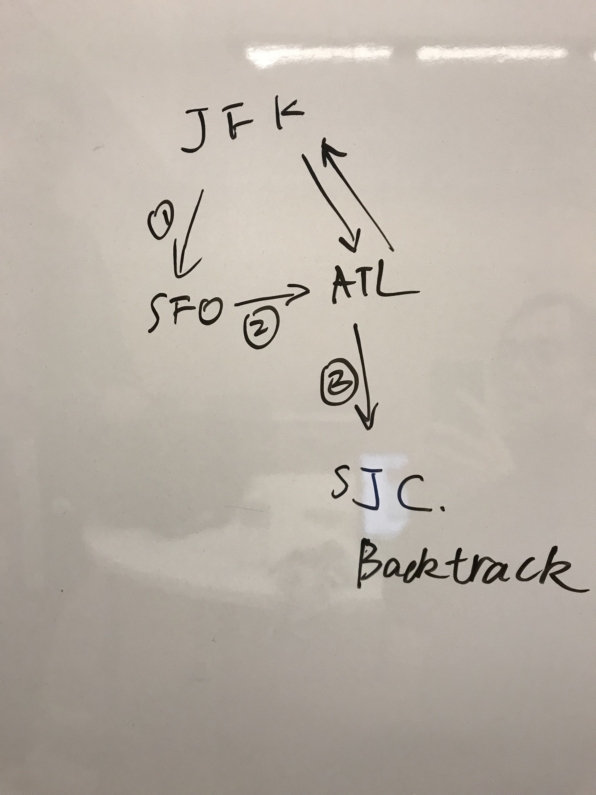

# DFS

## Todo List

### 785. Is Graph Bipartite? \(evaluate on edges instead of nodes, by definition\)

bug: 

```python
def isBipartite(self, graph):
    # undirected graph
    # several approaches
    # 1. bipartite properties: odd-length cycle
    # 2. DFS visit
    
    # core: ensure for every edge, both the ends are in different `color`
    # natural, edges are directly given
    
    # impl: recursively explores all edges
    n = len(graph)
    color = [0] * n  # 0: uninit, 1: black, 2: white
    def verify(node):
        """return whether the component is bipartite"""
        if color[node] == 0:
            color[node] = 1  # assign color, !might be not a good place to do, check later
        whichColor = color[node]
        edges = graph[node]
        while edges:  # each edge is explored once, runtime guaranteed
            dest = edges.pop()
            if color[dest] == 0:
                color[dest] = 2 if whichColor == 1 else 1
                if not verify(dest):  # bug! didn't recursively call
                    return False
            elif color[dest] == whichColor:
                return False
        return True
    
    # the graph is bipartite iff all components are biparity
    return all(verify(i) for i in range(n))

# tests
# [[0]] -- self cycle
# -- a tree
# [[1,2],[0],[0]]
# [[1],[0,3],[3],[1,2]]
# -- even-length cycle
# [[1],[0]]
# [[1,3], [0,2], [1,3], [0,2]]
# -- odd-length cycle
# [[1,2],[0,2],[0,1]]
# [[1,4],[0,2],[1,3],[2,4],[3,0]]  # larger size
# [[1,2,3], [0,2], [0,1,3], [0,2]]
# -- multiple components
# [[1,3], [0,2], [1,3], [0,2], [5],[4]]
# [[1,3], [0,2], [1,3], [0,2], [5,6], [4,6], [4,5]] 
```


## Problems

### 332. Reconstruction Itinerary

much complicated than 207/210: allow cycle the in path  
saw Stefan's solution



Nov: a new method to tackle it with **queue, prove** that the path order remain unchanged after a layer \(including recursive call\) of execution



The **beauty** of back tracking !!!

```python
def findItinerary(self, tickets):
    # a easy way to do back track: not the optimal, actually with queue -> optimal
    # avoid using 2-d map
    
    # construct graph
    graph = {} # {str: str[]}
    for src, dest in tickets:
        graph.setdefault(src, []).append(dest)
    # fix for picking order of destination
    for src in graph:
        graph[src] = deque(sorted(graph[src]))
        
    hops = len(tickets)
    
    work = ['JFK']
    def constructPath(): # return if the with the current work list, is it able to construct the path correctly
        nonlocal hops
        
        if len(work) == hops + 1:
            return True
        start = work[-1]
        q = graph.get(start, []) # nothing
        # try all the successor without duplicate
        # not sure the order would remain?
        for _ in range(len(q)):
            dest = q.popleft()
            work.append(dest)
            if constructPath():
                return True
            work.pop()
            q.append(dest)
        return False
    
    constructPath()
    return work
```


