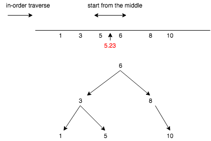
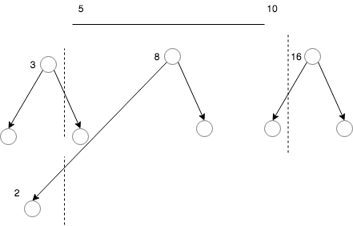
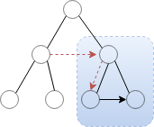

# Tree problems

June 4, 6, 7, 8, 12

Nov

## Tackling the problem in different ways

272. Closest Binary Search Tree Value II, draw it on the real number line

* In-order: linear search thru the tree
* Two way in-order: first find the node; then expand from the middle

## Simple recursion: one root as para, single return type

normally a **D&Q** approach suffices

* 104 max depth
* 669 trim BST \(画数轴与数比较\)

## Complex Return type: helper states to calculate the expected result

### 

## Construction: divide & conquer \(post order\)

Find the root and do it recursively

* 654 Maximum Binary Tree
* 105 Construct Binary Tree from Preorder and In-order Traversal
  * big assumption: **no duplication** \| meaning the constructed tree is unique; without this condition \[1,1\], \[1,1\] has two possible implications
* 98 Valid BST
* 110  balanced tree \(top sol: 2 approaches, do complexity analysis\)

  bug: didn't +1 for counting depth

## Top-down traverse \(pre order\)


caveat: when decided to pass information from parent to children, set return type to void \(one-way data flow makes logic much reasonable!\)


* 112 Path Sum: did it wrong, base case should be **leave nodes**
* 113 Path Sum II
* 98 Valid BST

## Different Traverse Order

* 366 traverse from leaves
* layer traverse:
  * 116 Construct Binary Tree from Inorder and Postorder Traversal \(O\(1\) space available\)  
    many solutions: 1. normal BFS, 2: DFS taking advantage of the **populated pointers**, 3: customized traverse \(O 1 space\) \[populate children and grand children, then traverse left to right, see [https://leetcode.com/problems/populating-next-right-pointers-in-each-node/discuss/37461/Java-solution-with-O\(1\)-memory+-O\(n\)-time](https://leetcode.com/problems/populating-next-right-pointers-in-each-node/discuss/37461/Java-solution-with-O%281%29-memory+-O%28n%29-time)\]

    

## Transformation    -&gt;  [Restructure \(to linked list\)](restructure.md)

These kinds of problems ask you to convert a tree to a linear structure \(like linkedlist\), in-/pre-/post-

* D&Q recommended 
* in-order traverse OK

