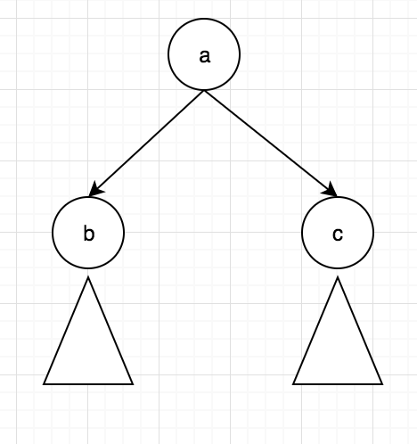
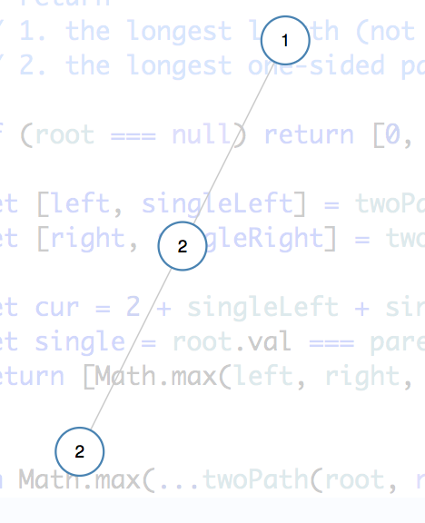
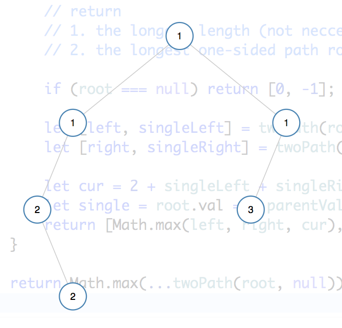

# Complex return type

## Functional 

### 687 longest univalue path

Big picture: the longest path might be **rooted** at any node of the tree, and the path contains left sub part and right sub part



  


From the perspective of a node, if either of its children has the same value, add it to the current count; be careful with left/right subpath should be single sided: only 0 or 1 path out of the two can contributed the upper level

The longest length can start with the root or not

|  |  |
| :--- | :--- |


### 124. Binary Tree Maximum Path Sum

return type \(singlePathSum, doublePathSum\): \(int, int\)  
singlePathSum: one sided sum **including** root.val  
doublePathSum: double sided sum **inc/exc** root.val

### 865. Smallest Subtree with all the Deepest Nodes

return type \(depth: int, subtree: TreeNode\)

### 230. Kth Smallest Element in a BST

```python
def kthSmallest(self, root, k):
    # [1], 1 -> 1
    # [2,1], 1 -> 1
    # [2,1], 2 -> 2
    # [2,1,3], 3 -> 3
    def traverse(root, k):
        if root is None:
            return k, None
        k, result = traverse(root.left, k)
        if result:
            return 0, result
        if k == 1:
            return 0, root
        k, result = traverse(root.right, k - 1) # inorder, subtract here
        return k, result

    return traverse(root, k)[1].val
```

