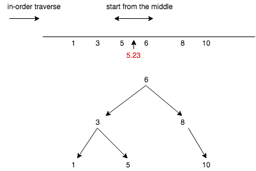
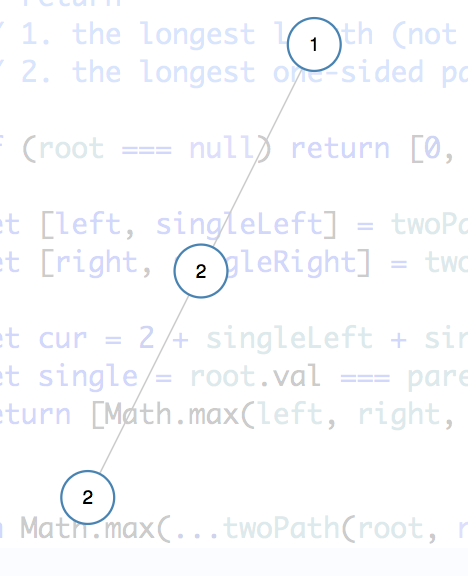
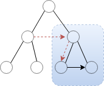

# Tree problems

June 4, 6, 7, 8, 12

Nov

## Tackling the problem in different ways

272. Closest Binary Search Tree Value II, draw it on the real number line

* In-order: linear search thru the tree
* Two way in-order: first find the node; then expand from the middle



## Simple recursion: one root as para, single return type

* 104 max depth
* 226 invert tree
* 669 trim BST \(画数轴与数比较\)


## Complex Return type: helper states to calculate the expected result

### 687 longest univalue path

Big picture: the longest path might be **rooted** at any node of the tree, and the path contains left sub part and right sub part


  


From the perspective of a node, if either of its children has the same value, add it to the current count; be careful with left/right subpath should be single sided: only 0 or 1 path out of the two can contributed the upper level

The longest length can start with the root or not

|  |  |
| :--- | :--- |


### 124. Binary Tree Maximum Path Sum

return type \(singlePathSum, doublePathSum\): \(int, int\)  
singlePathSum: one sided sum **including** root.val  
doublePathSum: double sided sum **inc/exc** root.val

### 865. Smallest Subtree with all the Deepest Nodes

return type \(depth: int, subtree: TreeNode\)

### 230. Kth Smallest Element in a BST

```python
def kthSmallest(self, root, k):
    # [1], 1 -> 1
    # [2,1], 1 -> 1
    # [2,1], 2 -> 2
    # [2,1,3], 3 -> 3
    def traverse(root, k):
        if root is None:
            return k, None
        k, result = traverse(root.left, k)
        if result:
            return 0, result
        if k == 1:
            return 0, root
        k, result = traverse(root.right, k - 1) # inorder, subtract here
        return k, result

    return traverse(root, k)[1].val
```


## Construction: divide & conquer \(post order\)

Find the root and do it recursively

* 654 Maximum Binary Tree
* 105 Construct Binary Tree from Preorder and In-order Traversal
  * big assumption: **no duplication** \| meaning the constructed tree is unique; without this condition \[1,1\], \[1,1\] has two possible implications
* 98 Valid BST
* 110  balanced tree \(top sol: 2 approaches, do complexity analysis\)

  bug: didn't +1 for counting depth

### 99. Recover Binary Search Tree

not worked it out yet

```python
def recoverTree(self, root):
    # [1, 2] -> [2, 1]
    # [2,3,1] -> [2,1,3]
    # [6,3,null,5] -> [6,5,null,3] # the most complicated case
    # [5,2,3,1,9,6,10] -> [5,2,9,1,3,8,10]
    # [6,1,null,3,null,2,null,5] # bug: fix too early

    # use the top-down method from validate BST

    def fixOrFindWrong(root, mn, mx):
        """if the root is the lowest common ancestor of the swapped node,
           fix at this level, otherwise return the wrong-positioned node
        """
        if root is None:
            return None
        if not (mn <= root.val <= mx): # bug: return too early
            return root

        # post-order
        leftWrong = fixOrFindWrong(root.left, mn, root.val)
        rightWrong = fixOrFindWrong(root.right, root.val, mx)
        if leftWrong is not None and rightWrong is not None:
            leftWrong.val, rightWrong.val = rightWrong.val, leftWrong.val
            return None
        wrong = leftWrong or rightWrong
        if wrong and mn <= wrong.val <= mx:
            wrong.val, root.val = root.val, wrong.val
            return None
        return wrong

    fixOrFindWrong(root, float('-inf'), float('inf'))
```

## Top-down traverse \(pre order\)

* 112 Path Sum: did it wrong, base case should be **leave nodes**, not null
* 113 Path Sum II
* 98 Valid BST

## Transformation

* 114. Flatten Binary Tree to Linked List two approaches: 1. in-order traverse; 2. post-order divide and conquer

## Different Traverse Order

* 366 traverse from leaves
* layer traverse:
  * 116 Construct Binary Tree from Inorder and Postorder Traversal \(O\(1\) space available\)  
    many solutions: 1. normal BFS, 2: DFS taking advantage of the **populated pointers**, 3: customized traverse \(O 1 space\) \[populate children and grand children, then traverse left to right, see [https://leetcode.com/problems/populating-next-right-pointers-in-each-node/discuss/37461/Java-solution-with-O\(1\)-memory+-O\(n\)-time](https://leetcode.com/problems/populating-next-right-pointers-in-each-node/discuss/37461/Java-solution-with-O%281%29-memory+-O%28n%29-time)\]

    


