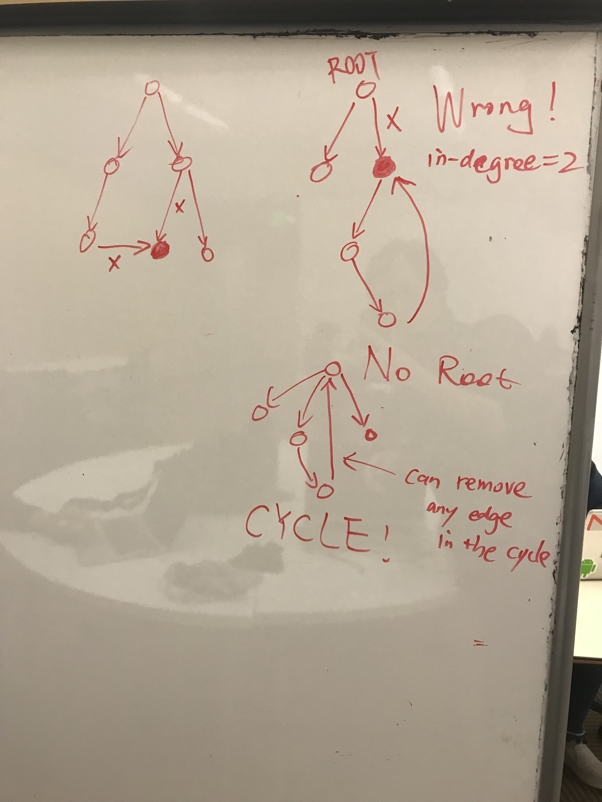

# Graph related

July: Two approaches: 1. solve it in a tree \(many steps\) 2. solve it in a graph

Nov: 

* first traversal: D & Q to store depth info of the path \(root to target\) into the map
* second traversal: from the perspective of each node
* space: O\(logn\) on average

```python
def distanceK(root, target, K):
    result = []
    node2distanse = {} # {TreeNode: int}
    def findDistances(root): # first phase
        if root is None:
            return None
        if root is target:
            distance = 0
            node2distanse[root] = 0
            return 1
        distance = findDistances(root.left) or findDistances(root.right) # guaranteed > 0 if any
        if distance:
            node2distanse[root] = distance
            return distance + 1
        return None
    
    def traverse(root, distance): # second phase
        if root is None:
            return
        if distance == K:
            result.append(root.val)
            # return # bug
        distanceDown = node2distanse[root.left] if root.left in node2distanse else distance + 1
        traverse(root.left, distanceDown)
        distanceDown = node2distanse[root.right] if root.right in node2distanse else distance + 1
        traverse(root.right, distanceDown)
        return distance
    
    findDistances(root)
    traverse(root, node2distanse[root])
    return result
```

approach using path

```python
from collections import deque
# this approach not promising
def distanceK(self, root, target, K): 
    def kthDescendents(root, k):
        # better to use BFS if iterative
        q = deque([root])
        for _ in range(k):
            if not q: break
            for _ in range(len(q)):
                node = q.popleft()
                q.extend(child for child in [node.left, node.right] if child)
        return map(lambda node: node.val, q)

    def constructPath(root):
        """ post-order """
        path = []

        def traverse(root):
            if root is None:
                return False
            if root is target or traverse(root.left) or traverse(root.right): # bug: compare value
                path.append(root)
                return True
            return False
        traverse(root)
        return path

    # find the target
    path = constructPath(root) # imp! no need to reverse the path: leave to root
    # print([x.val for x in path])

    # test
    # [1], 1, 0 -> [1]
    # [1,2,3], 1, 1 -> [2,3]
    # [1,2,null,3], 2, 1 -> [1,3]
    result = []
    prev = None
    for offset, node in enumerate(path): 
        left, right = node.left, node.right
        # clean the explored nodes
        if node.left is prev:
            node.left = None
        elif node.right is prev:
            node.right = None

        if K < offset: break # bug: should eliminate nodes too far away
        result.extend(kthDescendents(node, K - offset)) # reuse of code

        node.left, node.right = left, right # restore
        prev = node

    return result
```


### 684. Redundant Connection \(undirected graph\)

can be easily solved by Union-find

### 685. Redundant Connection II \(directed graph\)

should identify why UF is no longer a valid method \(in some cases\)



Since UF only cares about connection \(doesn't care direction\), false positive would happen when there is a weakly connected component  
the only case where UF fails is when **the redundant edge connects a node to its ancestor**

my awkward solution: 

1.  find the root if possible \(otherwise, use UF, there is a cycle in the graph\)
2. find the paths from root to node \(called G\) with in-degree of 2, possibly there would be 1 path or 2 paths a\). 1 path means, the failing case! b\). 2 paths: we can remove either edge going into G


