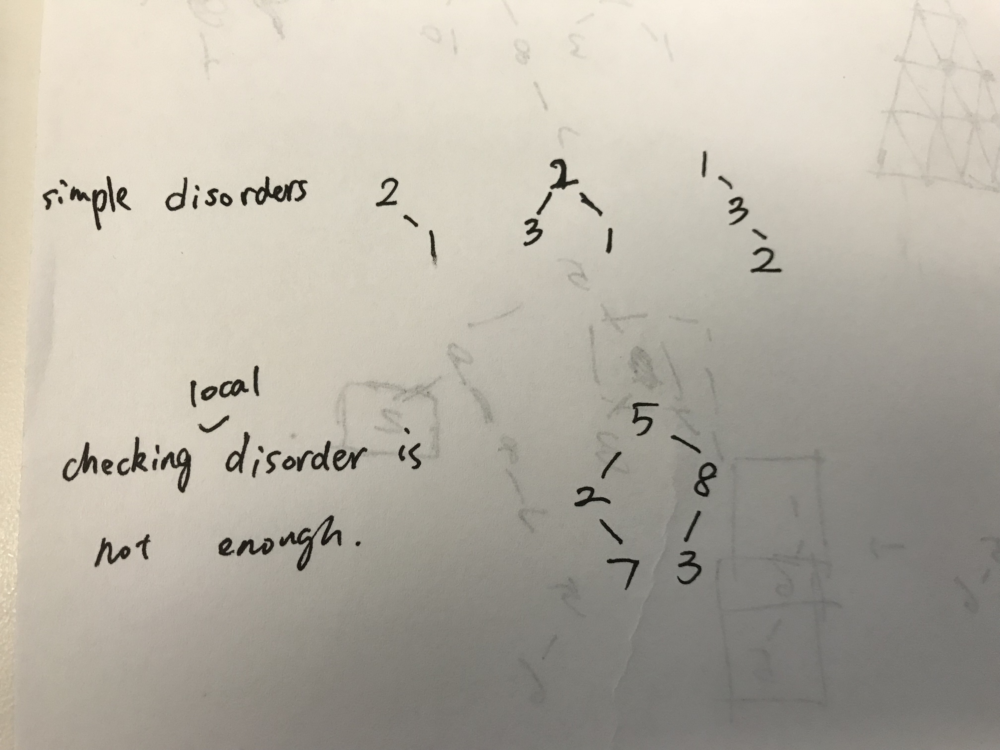

# In-order traverse

### 99. Recover Binary Search Tree

Too many cases for a divide & conquer solution, too different mind set for two approaches  
1. parent-child swap; 2. descendants of a node swap; direct descendant swaps are tricky



the case at the bottom is counter part for just checking local reverse \(parent-child reverse\); however, in-order traverse is global check

refer to concise solution: [https://leetcode.com/problems/recover-binary-search-tree/discuss/32535/No-Fancy-Algorithm-just-Simple-and-Powerful-In-Order-Traversal](https://leetcode.com/problems/recover-binary-search-tree/discuss/32535/No-Fancy-Algorithm-just-Simple-and-Powerful-In-Order-Traversal), very neat part of the solution is that it **swaps node values instead of pointers**

Some thoughts:  
  - in-order traverse is the best  
  - pre-order + post order could work: pass the ranges down; get disorders nodes bottom up

98 Valid BST  
reference: [https://leetcode.com/problems/validate-binary-search-tree/discuss/32112/Learn-one-iterative-inorder-traversal-apply-it-to-multiple-tree-questions-\(Java-Solution\)](https://leetcode.com/problems/validate-binary-search-tree/discuss/32112/Learn-one-iterative-inorder-traversal-apply-it-to-multiple-tree-questions-%28Java-Solution%29)

### 272. Closest Binary Search Tree Value II

画数轴

```python
def closestKValues(self, root, target, k):    
    result = deque()

    # [1,2], 3, 2 -> [1,2] # always have solution given valid k
    # [3,2,4,1], 2.5, 2 -> [2,3]
    # [3,2,4,1], 2.5, 3 -> [2,3,4]
    def inorder(root):
        if root is None:
            return
        inorder(root.left)

        # main logic
        if len(result) < k:
            result.append(root.val)
        elif target - result[0] > root.val - target: # bug: wrong direction
            result.popleft()
            result.append(root.val)
        else:
            return

        inorder(root.right)

    inorder(root)
    return [num for num in result]
```


