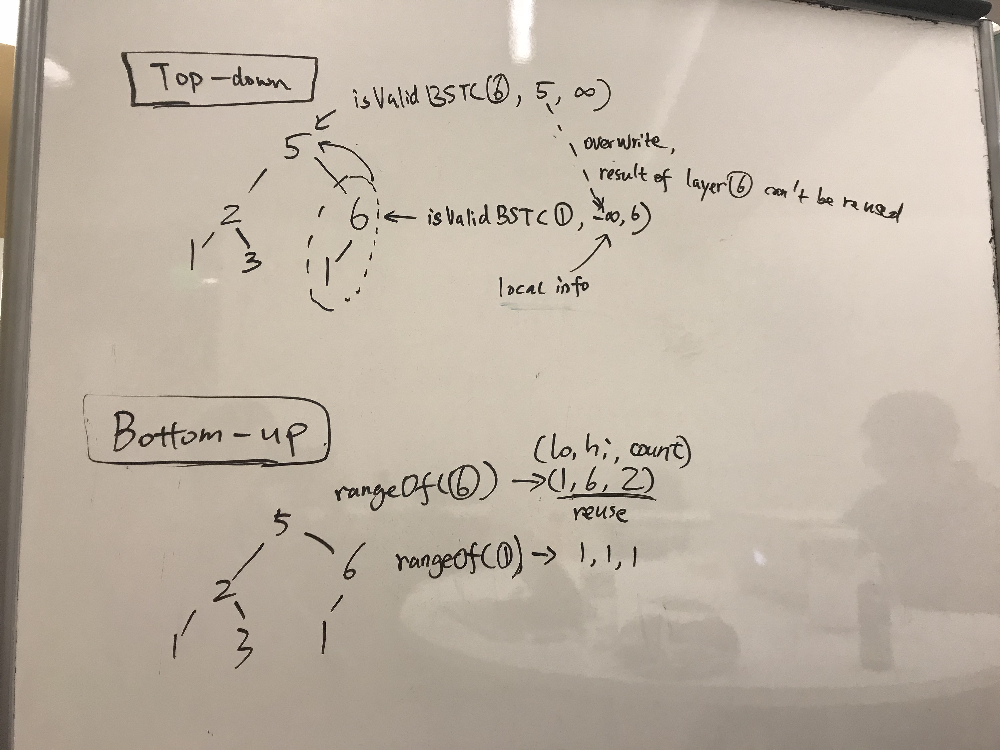

# pre-order vs. post-order

### 333. Largest BST Subtree - \(a case bottom-up method is better\)

some thoughts:

* in-order traversal wouldn't work, \[2,1,3,null,null,1\], the whole tree should be considered without ignoring any descendent
* can achieve by top-down method
* can bottom-up logic is a little

#### why top-down approach cannot be done in O\(n\): context lost



```python
def isValidBST(root, lo, hi) # (Node, int, int) -> count
def traverse(root)
```

#### for bottom-up case: better to assume the absence of null pointer

```python
def rangOf(root) # (Node) -> (int?, int?, int?)
```

