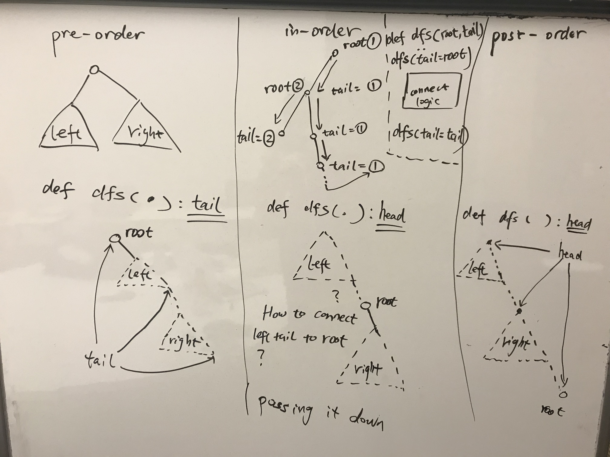

# Restructure \(to linked list\)



### 

### 897. Increasing Order Search Tree

in-order traversal \(iterative\), 1 bug -&gt; didn't clean up pointer

do it  recursively?

bonus: Morris traversal


### 114. Flatten Binary Tree to Linked List

iterative using stack


### Follow-up: flatten by post-order

recursive methods for the three transformation

```python
def flattenPre(root): # return the tail of the flatten list
    if root is None:
        return None
    leftTail = flattenPre(root.left)
    rightTail = flattenPre(root.right)
    if leftTail:
        leftTail.right = root.right
        root.right = root.left
    root.left = None
    return rightTail or leftTail or root
flattenPre(root)

def flattenPost(root): # return the head of list
    if root is None:
        return None
    leftHead = flattenPost(root.left)
    rightHead = flattenPost(root.right)
    if root.left:
        root.left.right = rightHead
    if root.right:
        root.right.right = root
    elif root.left:
        root.left.right = root
    root.left, root.right = None, None
    return leftHead or rightHead or root

def flattenInorder(root, tail): # return the head of list
    if root is None:
        return tail
    leftHead = flattenInorder(root.left, root)
    root.left = None
    flattenInorder(root.right, tail) # tail from the ancestor
    return leftHead
```


### 430. Flatten a Multilevel Doubly Linked List

from perspective of a node, pretty much the same as pre-order

