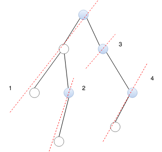

# \*Iterator

### **173. Binary Search Tree Iterator**

iterative Binary tree traverse

two elements composing the current state: current node and the stack

* current node is the node to explore next
* stack store nodes to explore after the current node

In-order -&gt; interpretation with two elment:

1. push left whenever possible to ensure that left children are popped first
2. push the right child to the stack for later use
3. return the current node


### 272. Closest Binary Search Tree Value II

```python
def closestKValues(self, root, target, k):
    # a good example dissecting the stack for DFS (tree traversal)
    # and also a great example to explore closure
    def get_generator(stack, preFunc, postFunc, exhaust):
        """preFunc/postFunc: TreeNode -> TreeNode
        """
        def generator():
            cur = None
            while cur or stack: # bug, termination condition, only checked stack
                while cur:
                    stack.append(cur)
                    cur = preFunc(cur)                        
                node = stack.pop()
                yield node.val
                suc = postFunc(node)
                if suc:
                    cur = suc # bug: didn't set
            # padding
            while True:
                yield exhaust
        return generator()

    # construct two stacks for the pred/suc generators
    pstack, sstack = [], []
    while root:
        if target < root.val:
            sstack.append(root)
            root = root.left
        else:
            pstack.append(root)
            root = root.right

    leftFunc, rightFunc = lambda x: x.left, lambda x: x.right
    pit = get_generator(pstack, rightFunc, leftFunc, float('-inf'))
    sit = get_generator(sstack, leftFunc, rightFunc, float('inf'))

    # tests
    # [1], 9, 1 -> [1]
    # [2, 1], 2, 1 -> [2]
    # [2, 1], 2, 2 -> [3]
    left, right = next(pit), next(sit)
    result = []
    for _ in range(k):
        # print(left, right)
        if target - left < right - target:
            result.append(left)
            left = next(pit)
        else:
            result.append(right)
            right = next(sit)
    return result
```



Caveat:

1. set current at right child
2. traverse left to the bottom before pop

